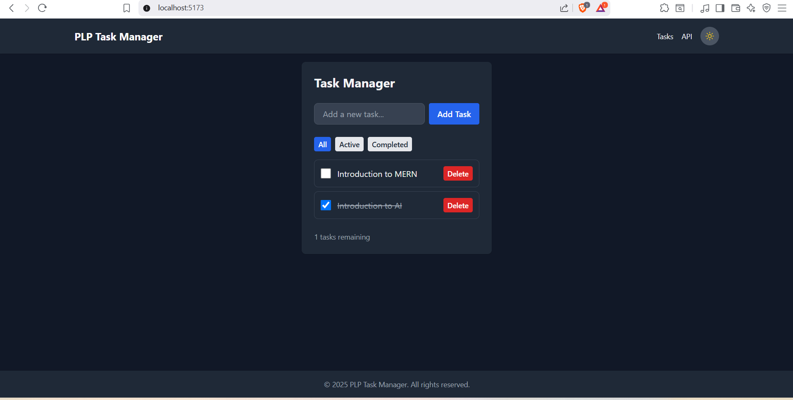
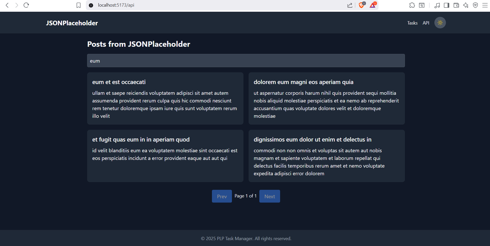

# 📝 PLP Week 3 – React Task Manager

A responsive and theme-enabled task manager built with **React.js**, **Tailwind CSS**, and **Vite**. It supports task creation, filtering, deletion, and fetching posts from a public API (JSONPlaceholder) with search and pagination features.

## 📸 Screenshots

### ✅ Task Manager


### 🌐 API Data Viewer


## 📦 Features

### ✅ Task Management
- Add, complete, delete tasks
- Filter tasks: All, Active, Completed
- Local storage persistence

### 🌐 API Integration
- Fetch posts from [JSONPlaceholder](https://jsonplaceholder.typicode.com/)
- Client-side search filter
- Pagination controls
- Error & loading handling

### 🎨 Styling with Tailwind CSS
- Responsive design (mobile → desktop)
- Light/Dark theme toggle with persistence
- Custom transitions and animations

## 🛠️ Setup Instructions

### ✅ Prerequisites
- Node.js v18+
- npm

### 🔧 Local Installation

---
```bash
# 1. Clone your GitHub Classroom repo
git clone https://github.com/PLP-MERN-Stack-Development/week-3-react-js-assignment-Denis-Mwanzia.git
cd week-3-react-js-assignment-Denis-Mwanzia

# 2. Install dependencies
npm install

# 3. Start development server
npm run dev

```
---